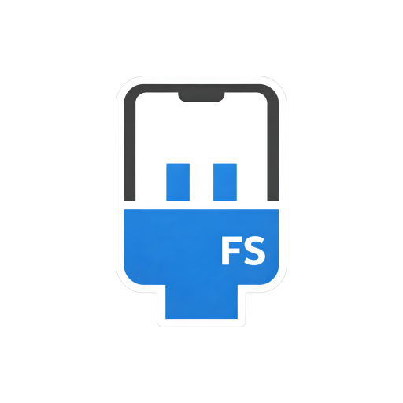
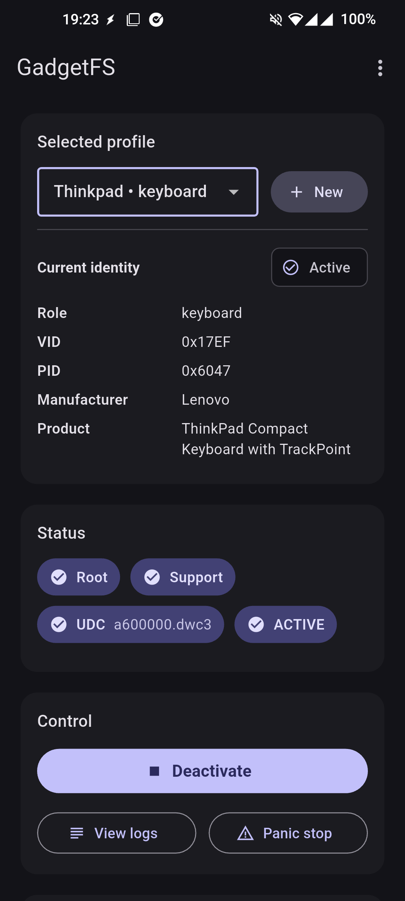
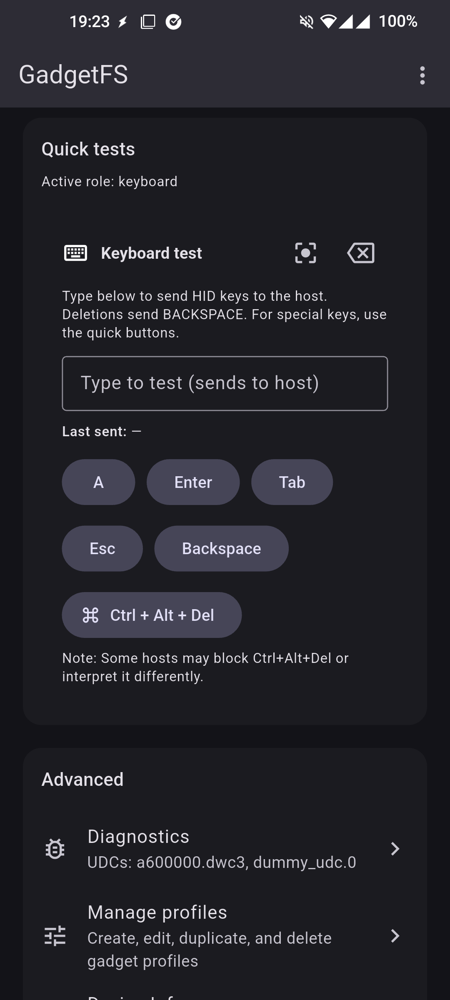
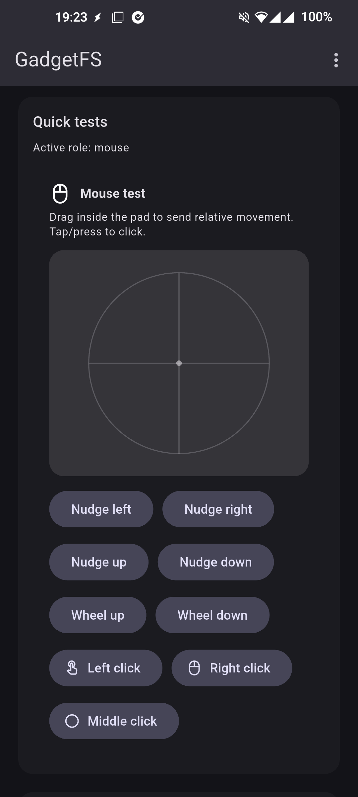
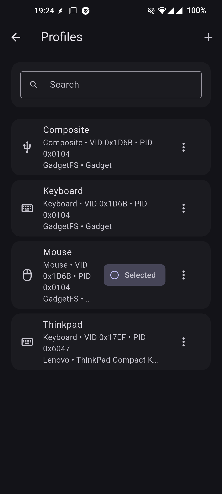
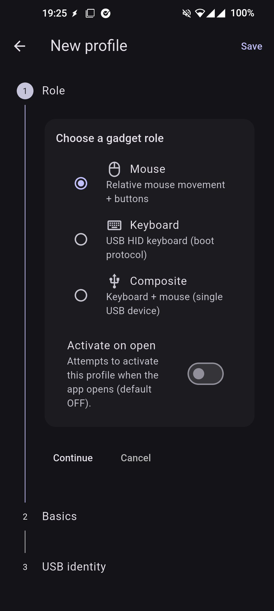
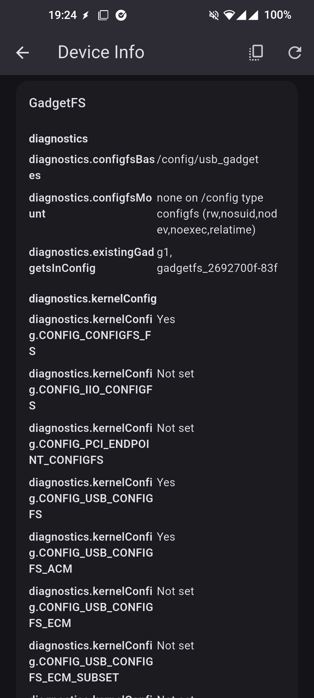

# GadgetFS - Android USB Gadget Manager

<a href="https://github.com/iodn/gadgetfs/releases">

</a>
<div>
<h3 style="font-size: 2.2rem; letter-spacing: 1px;">GadgetFS - Android USB Gadget Manager</h3>
<p style="font-size: 1.15rem; font-weight: 500;"><strong>Open-source ConfigFS USB gadget manager for rooted Android devices</strong><br><strong>GadgetFS</strong> lets you create, configure, activate, and tear down USB HID gadget roles from Android. It provides profile-based Keyboard, Mouse, and Composite configurations, descriptor editing, UDC binding control, quick HID tests, diagnostics, and native logs for low-level USB gadget workflows.</p>

<div align="center">

  [](LICENSE)
  [](https://github.com/iodn/gadgetfs/issues)
  [](https://github.com/iodn/gadgetfs/pulls)
  [](https://www.android.com)
  [](#requirements)

  <div style="display:flex; align-items:center; gap:12px; flex-wrap:wrap; justify-content:center;">
    <a href="https://github.com/iodn/gadgetfs/releases" style="display:inline-flex; align-items:center;">
      
    </a>
  </div>
</div>

## Overview

- ConfigFS gadget provisioning:
  - Creates USB gadget directories, string descriptors, configurations, and HID functions through privileged shell scripts.
- Built-in HID roles:
  - Mouse, Keyboard, and Composite Keyboard + Mouse profiles.
- Descriptor control:
  - Configure VID/PID, manufacturer, product, serial number, and activation behavior per profile.
- Deterministic lifecycle:
  - Activate, deactivate, clean up, and panic-stop gadgets with live status updates.
- Diagnostics-first design:
  - Inspect root state, ConfigFS paths, UDCs, active gadget state, HID device nodes, and backend logs.

Note: GadgetFS requires root and a physical Android device whose kernel supports USB gadget mode through ConfigFS. Emulators cannot validate USB gadget behavior.

## Features

- Profile Management
  - Create, edit, duplicate, and delete gadget profiles.
  - Choose Mouse, Keyboard, or Composite role.
  - Persist profiles on-device.
  - Optional Activate on Open behavior for repeat workflows.

- USB Descriptors
  - Configure vendor ID, product ID, manufacturer, product, and serial number.
  - Use an embedded `usb.ids` database to look up known vendors and products.
  - Keep role-specific descriptor settings separate across profiles.

- Gadget Lifecycle
  - Bind and unbind a selected profile to an available UDC.
  - Clean up ConfigFS artifacts during deactivation.
  - Panic Stop performs best-effort unbinding of active/conflicting gadgets.
  - Foreground service keeps the active gadget alive while the app is backgrounded.

- Quick HID Tests
  - Send keyboard key reports.
  - Send mouse movement reports.
  - Send Ctrl+Alt+Del for validation.
  - Test controls adapt to the active role.

- Diagnostics & Logs
  - Root availability, ConfigFS support, UDC list, active state, bound gadgets, and HID writer readiness.
  - Native log stream with timestamps for provisioning, binding, cleanup, and report writes.
  - Device info screen for hardware, OS, runtime, and GadgetFS status.

## Requirements

- Rooted Android device with a working `su` implementation.
- Linux USB Gadget and ConfigFS support in the device kernel.
- A UDC exposed under `/sys/class/udc`.
- ConfigFS mounted under `/sys/kernel/config/usb_gadget` or `/config/usb_gadget`.
- HID gadget support that can create device nodes such as `/dev/hidg*`.
- A physical USB data connection to the host. Charge-only cables will not work.

## Installation

1. Download the latest APK from Releases:

  <a href="https://github.com/iodn/gadgetfs/releases" style="display:inline-flex;">
    
  </a>

2. Install the application:
   - Enable installation from unknown sources if needed.
   - Grant root when prompted by your root manager.

3. Launch and configure:
   - Open GadgetFS.
   - Confirm root and USB gadget readiness on the dashboard.
   - Create or select a profile.
   - Activate the profile and verify enumeration on the connected host.

## Usage

### Activating a Gadget Profile

1. Connect the Android device to the host with a data-capable USB cable.
2. Open GadgetFS and confirm root, ConfigFS, and UDC readiness.
3. Select a Mouse, Keyboard, or Composite profile.
4. Review the VID/PID and USB strings.
5. Tap Activate.
6. Use quick tests to confirm that the host receives HID reports.

### Editing Profiles

1. Open Profiles.
2. Add or edit a profile.
3. Choose the role and set descriptor fields.
4. Save the profile.
5. Activate it from the dashboard when needed.

### Diagnostics and Recovery

1. Open Diagnostics or Logs when a gadget does not enumerate.
2. Check root, UDC, ConfigFS path, bound gadget, and HID node details.
3. Use Deactivate for normal cleanup.
4. Use Panic Stop when a stale gadget remains bound or the host state is stuck.

## Profiles and Descriptors

- Mouse:
  - Creates a relative HID mouse function.
  - Sends 4-byte mouse reports for movement, wheel, and button tests.
- Keyboard:
  - Creates a boot keyboard HID function.
  - Sends 8-byte keyboard reports for key and combo tests.
- Composite:
  - Creates keyboard and mouse functions under one gadget configuration.
  - Useful when the host should enumerate both input devices at once.

Configurable USB fields:

- `idVendor`
- `idProduct`
- Manufacturer string
- Product string
- Serial number
- Activate on Open behavior

## Screenshots

  
  
  
  
  
  
  
  
  

## Build and Run

Prerequisites:

- Flutter stable toolchain
- Android SDK configured for Flutter
- A rooted physical Android device for runtime validation

Steps:

```bash
flutter pub get
flutter run
```

Release builds:

- Configure a proper release signing setup before publishing.
- The current Gradle release build uses debug signing for local convenience.

## Troubleshooting

- Root check fails:
  - Verify Magisk/SU policy and grant root to GadgetFS.
- No UDC found:
  - Confirm `/sys/class/udc` contains a controller and the device supports USB device mode.
- Host does not enumerate the gadget:
  - Use a data cable, try another USB port, and validate VID/PID and role descriptors.
- HID devices are missing:
  - The kernel or ROM may not include the required HID gadget functions.
- Gadget remains bound after a crash:
  - Use Panic Stop, then reconnect USB if needed.

## Security Notes

- GadgetFS changes how the Android device presents itself over USB while active.
- Root access and ConfigFS writes can affect ADB, charging behavior, and other USB gadget functions.
- Use it only on systems you own or are authorized to test.

## Contributing

Contributions are welcome. If you add roles, descriptors, lifecycle behavior, or diagnostics, please include matching UI validation and focused tests where practical.

## License

This project is licensed under the GNU GPLv3 License. See [LICENSE](LICENSE).

## Support

If you encounter issues or have device compatibility notes, open an issue on the GitHub repository.

## More Apps by KaijinLab

| App                                                               | What it does                                                                 |
| ----------------------------------------------------------------- | ---------------------------------------------------------------------------- |
| **[IR Blaster](https://github.com/iodn/android-ir-blaster)**      | Control and test infrared functionality for compatible devices.              |
| **[USBDevInfo](https://github.com/iodn/android-usb-device-info)** | Inspect USB device details and behavior to understand what's connected.      |
| **[GadgetFS](https://github.com/iodn/gadgetfs)**                  | Manage rooted Android USB gadget roles with ConfigFS.                        |
| **[TapDucky](https://github.com/iodn/tap-ducky)**                 | Run controlled DuckyScript HID workflows on supported rooted devices.        |
| **[HIDWiggle](https://github.com/iodn/hid-wiggle)**               | Keep a connected host awake with Android-powered USB HID mouse movement.     |
| **[AKTune](https://github.com/iodn/android-kernel-tweaker)**      | Adaptive Android kernel auto-tuner for CPU/GPU/scheduler/memory/I/O.         |
